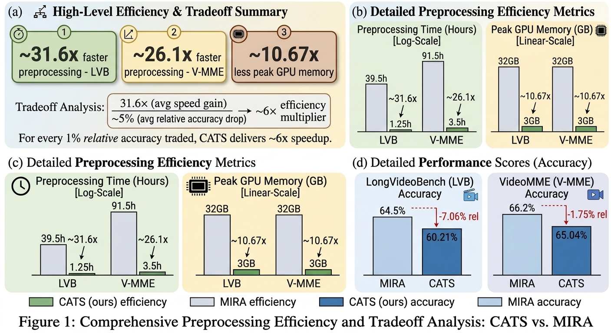
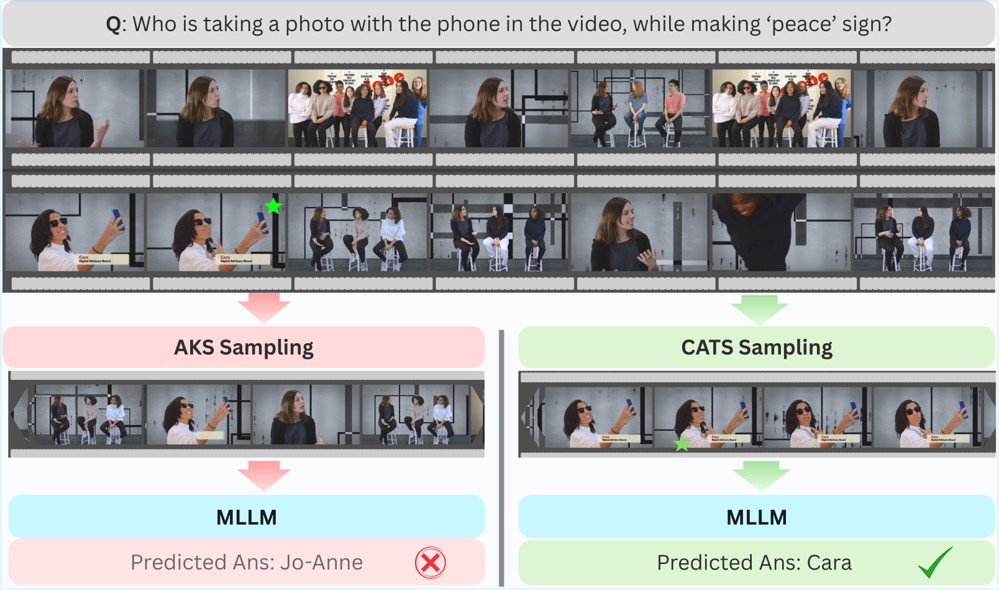
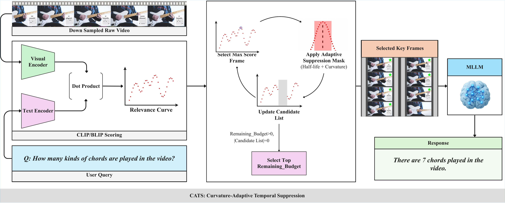
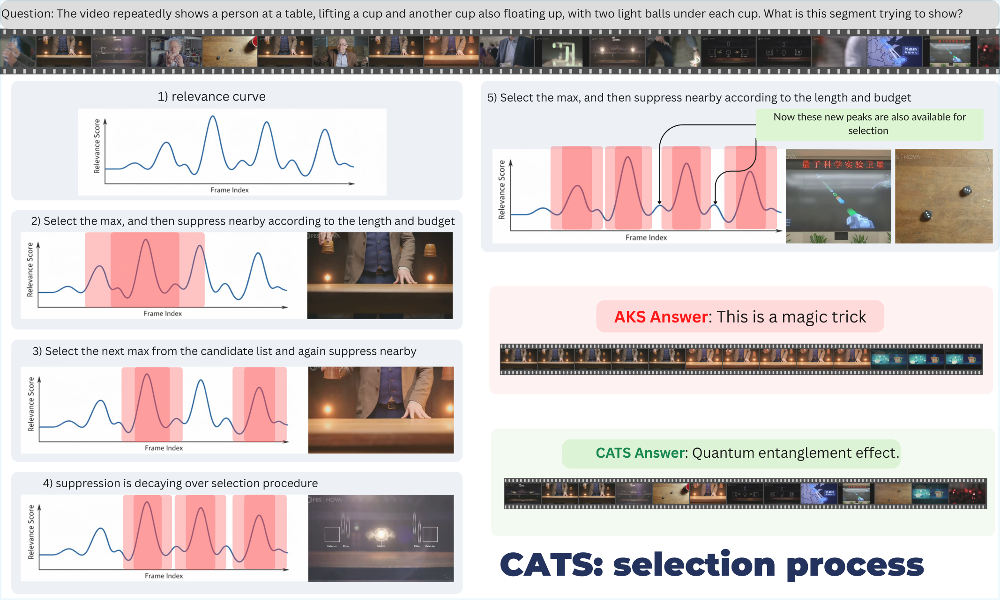
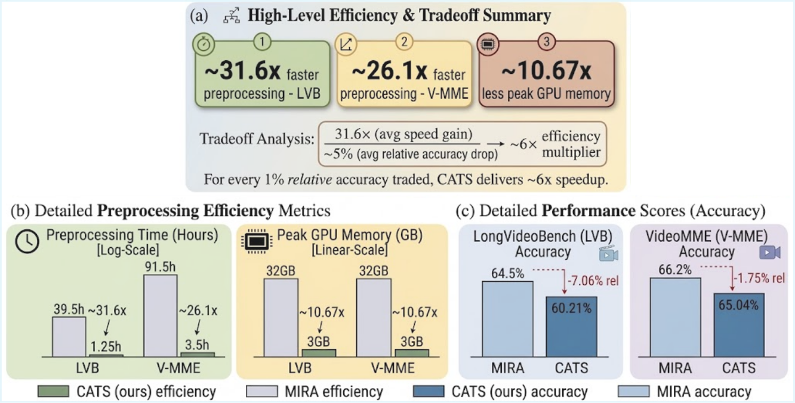
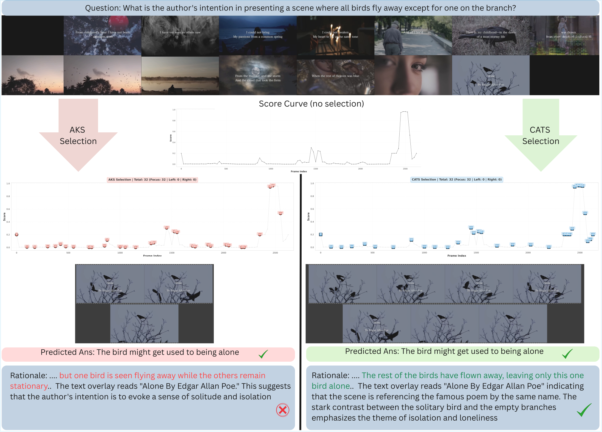
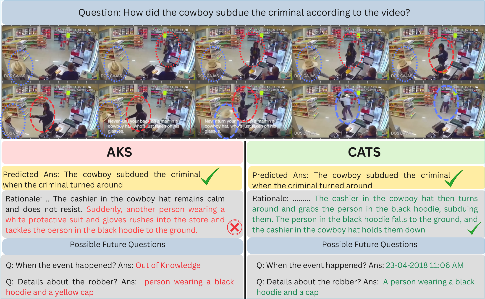

# CATS: Curvature-Aware Temporal Selection for Efficient Long-Video Understanding

<p align="center">
  <a href="#"></a>
  <a href="#"></a>
  <a href="#"></a>
  <a href="#"></a>
  <a href="#"></a>
</p>

<p align="center">
  
</p>
<p align="center">
  <em>Figure 1. CATS achieves <strong>~31.6×</strong> faster preprocessing and <strong>~10.7×</strong> lower peak GPU memory than MIRA, while retaining <strong>93–98%</strong> of its accuracy on LongVideoBench and VideoMME.</em>
</p>

---

> **CATS** is a lightweight, **training-free** keyframe selection algorithm for long-video question answering. It models the temporal *geometry* of query–frame relevance and uses local **curvature** to adaptively allocate a tight frame budget — concentrating frames around semantic transitions and dispersing them in flat regions. The result is near-state-of-the-art accuracy at a small fraction of the compute.

**Authors.**
Mehrajul Abadin Miraj¹, Abdul Mohaimen Al Radi², Shariful Islam Rayhan¹, Md. Tanvir Alam¹, Ismat Rahman¹, Yu Tian², Md Mosaddek Khan¹
*(¹ University of Dhaka · ² University of Central Florida)*

---

## Table of Contents

- [Why CATS](#why-cats)
- [Method at a Glance](#method-at-a-glance)
- [Selection Process](#selection-process)
- [Headline Results](#headline-results)
- [The TempRel Diagnostic Dataset](#the-temprel-diagnostic-dataset)
- [Beyond Accuracy: Description Quality](#beyond-accuracy-description-quality)
- [Repository Structure](#repository-structure)
- [Installation](#installation)
- [Quick Start](#quick-start)
- [Reproducing Paper Results](#reproducing-paper-results)
- [Hardware](#hardware)
- [Citation](#citation)
- [License & Acknowledgments](#license--acknowledgments)

---

## Why CATS

Multimodal LLMs cannot ingest every frame of a long video — context budgets force a hard upper bound (typically 16–64 frames). The selection problem is combinatorial in video length, and the dominant strategies sit at two unsatisfying extremes:

- **Heuristic selectors** (uniform sampling, top-K, AKS): cheap, but treat frames in isolation or rely on coverage assumptions that can collapse to near-uniform allocation.
- **Multi-stage retrieval pipelines** (e.g., MIRA): accurate, but expensive — multiple scoring stages, iterative routing, and dataset-specific tuning.

CATS occupies the missing middle: it is **content-aware like MIRA, cheap like AKS, and free of dataset-specific hyperparameters**. The key idea is that the *temporal relevance signal* — the score curve of a vision–language model evaluated against the query over time — already encodes where the informative content lies. Reading the **second derivative** of that curve tells us *where to sample densely* and *where to spread out*.

<p align="center">
  
</p>
<p align="center">
  <em>Figure 2. Given the same query and budget, AKS distributes frames by a relevance–coverage trade-off and misses the critical moment, leading to a wrong answer. CATS uses temporal curvature to sample densely around the salient event, producing the correct prediction.</em>
</p>

## Method at a Glance

<p align="center">
  
</p>
<p align="center">
  <em>Figure 3. End-to-end pipeline. A frozen vision–language encoder produces a per-frame relevance signal against the user query. CATS iteratively picks the highest-scoring frame and applies an adaptive suppression mask whose radius is modulated by local curvature and decays with each iteration. The selected keyframes are passed to the MLLM for response generation.</em>
</p>

Given a video **V** = {F₁, …, F_T} and query **Q**, CATS proceeds in three stages:

1. **Relevance signal.** A frozen vision–language scorer (BLIP / CLIP / SeViLA) produces per-frame relevance scores `s(Q, F_t) ∈ [0, 1]`.
2. **Curvature-modulated suppression.** At each iteration, select the frame `i` with the highest remaining score, then suppress its neighborhood. The suppression radius is *not* fixed — it shrinks where the relevance signal bends sharply:

   ```
   R_base = L / M                        # average spacing under uniform allocation
   R_i    = R_base / (1 + κ_i)           # shrink in high-curvature regions
   κ_t    = | s_{t+1} − 2·s_t + s_{t−1} | # discrete second derivative
   ```

3. **Decaying coverage.** The influence of an earlier selection fades with each iteration, allowing previously suppressed regions to re-emerge:

   ```
   R_i^(t) = R_i · exp(−λ · Δs),   λ = ln(2) / (ρ · M)
   ```

The procedure is essentially **non-maximum suppression with a spatially varying, temporally decaying window** — adaptive enough to capture both abrupt cuts and slow buildups, simple enough to require no training and no per-dataset tuning.

## Selection Process

<p align="center">
  
</p>
<p align="center">
  <em>Figure 4. Step-by-step view of CATS. (1) The relevance curve is computed against the query. (2–3) The current maximum is selected and its neighborhood suppressed. (4) Suppression decays across iterations, allowing earlier-suppressed regions to re-emerge. (5) Final frames concentrate around the semantically meaningful events, leading to a correct, well-grounded answer where AKS fails.</em>
</p>

## Headline Results

**Accuracy (training-free, identical backbone, identical frame budget).**

| Method | Type | Backbone | Frames | LongVideoBench (val) | VideoMME |
|---|---|---|:--:|:--:|:--:|
| AKS† | Training-free | LLaVA-Video-7B | 32 | 59.76 | 64.48 |
| MIRA | Training-free | LLaVA-Video-7B | 64 | 64.50 | 66.20 |
| **CATS (ours)†** | **Training-free** | **LLaVA-Video-7B** | **32** | **60.21** | **65.04** |

<sub>† Reproduced under our evaluation harness with the authors' released code.</sub>

**Efficiency (preprocessing only, single RTX 5090).**

| | Time — LVB | Time — V-MME | Peak VRAM — LVB | Peak VRAM — V-MME |
|---|:--:|:--:|:--:|:--:|
| MIRA | 39.5 h | 91.5 h | 32 GB | 32 GB |
| **CATS** | **1.25 h** | **3.5 h** | **3 GB** | **3 GB** |
| **Speedup** | **~31.6×** | **~26.1×** | **~10.7×** | **~10.7×** |

<p align="center">
  
</p>
<p align="center">
  <em>Figure 5. Efficiency–accuracy frontier. For every 1% of relative accuracy traded, CATS delivers roughly a 6× compute speedup over MIRA.</em>
</p>

**Robustness across scorers** (LVB / V-MME accuracy at *k* = 32):

| Scorer | AKS | **CATS** |
|---|:--:|:--:|
| BLIP | 59.76 / 64.48 | **60.21 / 65.04** |
| CLIP | 58.41 / 64.33 | **59.88 / 65.04** |
| SeViLA | 58.86 / 63.56 | **59.16 / 64.19** |

The relative ordering is preserved across every scorer we tested — the gain comes from the **selection geometry**, not from a particular relevance model.

## The TempRel Diagnostic Dataset

Existing benchmarks blend many failure modes. To stress-test selection under controlled temporal structure, we constructed **TempRel**, a diagnostic with two regimes:

- **Extended Relevance (ER)** — relevant evidence is spread over a long span; pointwise top-K collapses.
- **Hierarchical Relevance (HR)** — a dominant peak coexists with secondary but informative events.

| Method | ER | HR | Overall |
|---|:--:|:--:|:--:|
| AKS | 62.22 | 76.16 | 68.96 |
| **CATS** | **67.13** | **80.83** | **73.64** |

The lift is largest in the ER regime, where modeling long-range relevance structure matters most.

## Beyond Accuracy: Description Quality

Multiple-choice accuracy is a noisy proxy — a correct option can be reached from partial cues. We additionally evaluate whether the **selected frames support faithful, grounded descriptions**, scored via an LLM-as-a-judge protocol with two independent judges (Gemini-3-Flash and GPT-5.4).

<p align="center">
  
</p>
<p align="center">
  <em>Figure 6. Verifiability beyond answer correctness. Both methods predict the correct option, but AKS misses the critical temporal transition and produces a partially inconsistent rationale. CATS performs event-centric dense sampling, capturing the key transition and yielding a coherent, visually grounded description.</em>
</p>

<p align="center">
  
</p>
<p align="center">
  <em>Figure 7. From rationale fidelity to future-query reasoning. AKS introduces hallucinated details due to missing visual evidence and fails on follow-up questions. CATS preserves critical temporal and contextual information, supporting consistent, evidence-aligned answers to future queries.</em>
</p>

| Dataset | Gemini-3-Flash Judge | GPT-5.4 Judge |
|---|:--:|:--:|
| LongVideoBench | **CATS 60.58** / AKS 39.42 | **CATS 59.46** / AKS 40.54 |
| VideoMME | **CATS 54.50** / AKS 45.50 | **CATS 54.30** / AKS 45.70 |

<sub>Inter-judge agreement: 82.7% (LVB), 79.5% (V-MME).</sub>

These descriptions can also serve as a **reusable semantic cache** — a well-grounded summary answers many follow-up queries without re-invoking the MLLM.

## Repository Structure

```
.
├── assets/                  # Figures rendered for this README
│   ├── efficiency_summary.png
│   ├── aks_vs_cats.png
│   ├── framework_overview.png
│   ├── selection_algorithm.png
│   ├── efficiency_tradeoff.png
│   ├── verifiability_dense_sampling.png
│   └── future_question.png
└── README.md
```

> **Code release.** The reference implementation, evaluation scripts, and the **TempRel** dataset will be released here upon paper acceptance. The sections below describe the intended interface.

## Installation

```bash
git clone https://github.com/<your-handle>/CATS.git
cd CATS

# Recommended: a fresh conda environment
conda create -n cats python=3.10 -y
conda activate cats

pip install -r requirements.txt
```

The pipeline depends on standard libraries: `torch`, `transformers`, `open_clip_torch`, `decord`, `numpy`, `tqdm`, and `lmms_eval` for benchmark evaluation.

## Quick Start

```python
from cats import CATSelector

selector = CATSelector(
    scorer="blip",      # one of {"blip", "clip", "sevila"}
    budget=32,          # number of frames to keep
    rho=0.5,            # decay schedule (no per-dataset tuning required)
)

frame_indices = selector.select(
    video_path="path/to/video.mp4",
    query="Why does the protagonist hesitate before opening the door?",
)
```

That's the full surface. CATS has **no learnable parameters** and **no dataset-specific knobs** — `budget` and the (optional) decay schedule `rho` are the only controls.

## Reproducing Paper Results

We use the [`lmms_eval`](https://github.com/EvolvingLMMs-Lab/lmms-eval) framework so numbers are directly comparable to published baselines.

```bash
# LongVideoBench (val), 32-frame budget, BLIP scorer
bash scripts/eval_lvb.sh --scorer blip --frames 32

# VideoMME, 32-frame budget
bash scripts/eval_vmme.sh --scorer blip --frames 32

# TempRel diagnostic
bash scripts/eval_temprel.sh --scorer blip --frames 32
```

Backbone for all reported numbers: **LLaVA-Video-7B**. Scorers: BLIP / CLIP / SeViLA. Results are deterministic across runs (variation < ±0.05%).

## Hardware

All preprocessing — frame extraction, relevance scoring, and selection — runs on a single **NVIDIA RTX 5090 (32 GB)**. CATS itself peaks at ~3 GB; the rest is occupied by the relevance scorer. Downstream MLLM inference follows the host model's requirements.

## Citation

If you use CATS, the TempRel dataset, or build on this work, please cite:

```bibtex
@article{miraj2025cats,
  title   = {CATS: Curvature-Aware Temporal Selection for Efficient Long Video Understanding},
  author  = {Miraj, Mehrajul Abadin and Al Radi, Abdul Mohaimen and Rayhan, Shariful Islam
             and Alam, Md. Tanvir and Rahman, Ismat and Tian, Yu and Khan, Md Mosaddek},
  journal = {Transactions on Machine Learning Research (TMLR)},
  year    = {2025},
  note    = {Under review}
}
```

## License & Acknowledgments

Released under the **MIT License** (pending code release).
We thank the authors of **AKS**, **MIRA**, **LLaVA-Video**, and **lmms-eval** for releasing the code and benchmarks that this work builds on. Computational resources were provided by the Department of CSE, University of Dhaka, and the University of Central Florida.

---

<p align="center">
  <em>For questions or collaborations, contact <a href="mailto:mehrajul.abedin.944@gmail.com">Mehrajul Abadin Miraj</a>
  or <a href="mailto:mosaddek@du.ac.bd">Md Mosaddek Khan</a>.</em>
</p>
